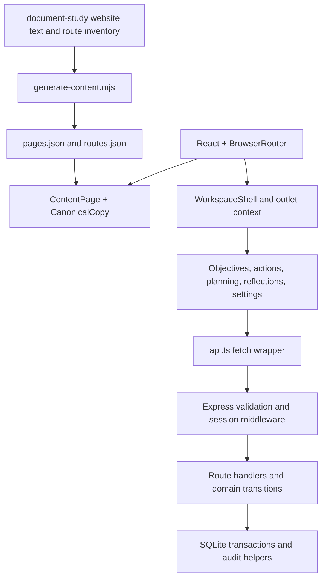

# LAMID ONE codebase study

Studied September 8, 2026. This report describes the checked-out implementation, rather than treating the older delivery documents as authoritative. Application source was not changed.

## Assessment

LAMID ONE is a local, persistent growth-planning application with a substantial document-driven public website. Its strongest implementation is the objective → action → explicit review → reflection cycle. Enterprise membership and marketplace APIs have been added, but their integration with authorization, lifecycle management, auditing, export, and the interface is incomplete.

The appropriate next increment is to make these existing domains consistent before adding autonomous AI or more feature surfaces. This does not require a rewrite: the existing same-origin architecture, validation, transactions, and API tests provide a useful foundation.

## Architecture and execution

`server/index.mjs` runs the single HTTP server on loopback. Development attaches Vite middleware; production serves `dist` with an SPA fallback. `server/app.mjs` owns input schemas, cookies, rate limits, authentication, tenancy, all feature APIs, and error handling. `server/store.mjs` owns SQLite initialization, password hashing, persistence helpers, transactions, and sample data.

The client uses React 19, TypeScript, React Router, Motion, and Three.js. `src/main.tsx` installs the router, motion policy, error boundary, local fonts, and ten ordered global stylesheets. Frontend TypeScript is strict, but the JavaScript backend and browser tests are outside the main TypeScript project's include list.

`WorkspaceShell` loads `/api/state`, supplies a typed outlet context, coordinates creation dialogs, search, workspace switching, and notifications. Mutations typically save and then reload the entire workspace. This is simple and understandable at small scale; there is no query cache, pagination, background synchronization, or request cancellation.

## What is implemented

| Area | Actual behavior |
| --- | --- |
| Public website | 98 generated page records with source paragraph references, shared rendering, mapped CTA destinations, navigation and help filtering |
| Authentication | Signup, login/logout, hashed session tokens, local recovery and verification tokens, isolated demo workspaces |
| Clarity | Create/edit objectives, priority filtering, version checks, completion check against unfinished actions |
| Capability | Displays objective success criteria and constraints; creates related actions |
| Consistency / Today | Action lists and boards, due/review filtering, controlled transitions |
| Workflows | Reuses the action board; no workflow execution engine |
| Companion | Multistep form creating an objective and optional first action atomically; no model connection |
| Rhythm / Progress | Saved reflections and counts derived from current actions; no historical analytics model |
| Governance / Audit | Review queue and searchable recent activity; no separate approver identity policy |
| Enterprise | Membership enrollment of existing users, session-selected tenant, member administration APIs |
| Marketplace | Point-charged posts and bids, client/freelancer proposal drafts through APIs; no corresponding feature screens found |
| Settings / Export | Workspace name/context editing and partial JSON workspace export |
| Other OS routes | Explicit planned-module view plus canonical source copy |

Account verification tokens exist, but verified status does not gate login or normal workspace use. Production token delivery is not connected. Selecting most starting contexts changes metadata, not an independent product implementation.

## The open file: WorkspaceParts.tsx

This is the shared presentation layer for the operating cycle:

- `PageHeading` takes screen text but prefers canonical source title/description for the current route. As a result, a screen's supplied personalized heading may never display.
- `StatusPill` converts status text into CSS class names.
- `ObjectiveCard` derives completion from linked actions and opens action creation.
- `ActionRow` shows an action and opens its detail dialog.
- `ActionDetail` exposes state-specific start, pause, resume, submit, approve, and return controls. It delegates persistence to the shell and displays request errors.

The API is the actual transition authority; hiding a button is not the enforcement mechanism. Action owner is stored as display text, not as a user foreign key. Explicit approval records a decision but does not establish separation between the person doing the work and the reviewer.

## Persistence model

Identity and commercial data use relational tables: users, sessions, workspaces, workspace_members, account_tokens, job_posts, bids, proposals, and points_ledger. Objectives, actions, and reflections share `records`, with JSON payloads, relational workspace ownership, and integer versions. Audit events are separate records with actor names and descriptive details.

SQLite enables foreign keys, WAL, and a busy timeout. `transaction()` uses `BEGIN IMMEDIATE`, commit, and rollback around synchronous work. Objective/action updates read the current version inside this transaction and reject stale callers with 409. Core operating-cycle mutations and their audit entries are atomic.

JSON action-to-objective references are validated in application code rather than by relational foreign keys. Searching and computing completion require reading and parsing workspace records. This is practical for a local foundation, but creates explicit migration and performance work as the dataset grows.

## Prioritized findings

These findings come from code inspection unless a test/build or supplemental probe result is explicitly cited. Browser reproduction was not performed during this study.

### 1. Workspace member administration changes global account access — high

`server/app.mjs:672` updates a membership, then sets `users.disabled_at` and deletes every session for that user. Login and authenticated middleware reject globally disabled users. An enterprise owner can therefore block a member from their personal workspace and other organizations, not just remove access to the owner's workspace. Reactivation also clears the global flag. The existing enterprise API test explicitly expects the global login failure, so passing tests preserve this behavior.

Separate membership suspension from ecosystem account suspension. Revoke or reset only sessions selecting the affected workspace. Add tests covering a personal workspace and two independent enterprise memberships.

### 2. Permanent deletion misses newer foreign-key relationships — high

`server/app.mjs:632` deletes account tokens, the user's sessions/memberships, owned workspace records/audit, workspaces, and the user. It does not handle job posts, bids, proposals, points ledger entries, or another member's session selecting an owned workspace. Those relationships reference the deleted user/workspace without cascading deletion in `server/store.mjs:23` onward.

An isolated in-memory API probe confirmed that creating a job succeeds with 201, then deleting that account fails with a foreign-key constraint and HTTP 500; the account remains intact after rollback. Define retention/deletion behavior for each dependency and test populated accounts, both sides of a commercial relationship, and active member sessions. The current test deletes a fresh account only.

### 3. Completed objectives can acquire unfinished actions — medium

The completion check is only in the objective PATCH handler (`server/app.mjs:833`). Action creation checks objective existence but not its state (`:876`). The shared objective schema also accepts `Complete` during `/plans` creation (`:802`), including when `nextAction` is supplied.

An isolated in-memory API probe confirmed that `/plans` returns 201 for a Complete objective with a Planned child action. Attaching a new action to an already completed objective is also permitted by the source checks. Enforce the invariant across every creation/update path, with an explicit reopen policy if appropriate.

### 4. Workspace switching retains forms and selected objects — medium

`WorkspaceShell.tsx:195` switches the server session and refreshes data, but does not remount the outlet by workspace ID or clear all feature state. `Settings.tsx:40` uses uncontrolled `defaultValue` inputs, so fields can retain the previous workspace's name/context after switching. Saving those fields now targets the newly selected workspace. Companion drafts and open dialogs can likewise survive a switch.

Key tenant-specific screens/forms by workspace ID or reset them deliberately. Resolve selected records from the current state by ID, and guard against outdated refresh responses. Test switching while Settings, Companion, and action/objective dialogs are open.

### 5. Startup rewrites enterprise configuration — medium

`server/store.mjs:57` unconditionally sets every Enterprise-context workspace to enterprise tier with a limit of 200 each time the store opens. This overwrites a smaller configured limit used during signup. Changing context to Enterprise through Settings can also change tier only on a later restart; changing away does not symmetrically demote it.

Replace startup data rewriting with versioned, transactional migrations. Make tier and capacity changes explicit operations, separate from descriptive context.

### 6. Export is partial and recent activity is truncated — medium

`server/app.mjs:768` exports the same object as `/state`. That includes at most 200 audit events (`:763`) and omits jobs, bids, proposals, points transactions, and a complete membership representation. It also includes the user's other active workspace summaries, so it is not strictly a single-workspace-only representation.

Define an export schema independently from dashboard state. Specify whether it is a personal export, tenant export, or restorable backup; implement appropriate authorization and full pagination/streaming for that contract.

### 7. New domains do not preserve the existing audit guarantees — medium

Job creation commits the charge, ledger, and post before writing audit (`server/app.mjs:488`). If logging fails, a client can receive an error after the post and charge persist. Bids, proposals, and member administration lack equivalent audit coverage. A retry of job creation has no idempotency key, so it creates another post and charge; the test title about charging once does not establish retry idempotency.

Move relevant audit writes inside their domain transactions and introduce idempotency for retryable point-charging operations. Consider unique database constraints for one bid per user/job rather than relying only on the pre-insert lookup.

### 8. Shared workspace permissions remain broad — policy decision needed

Normal members pass tenancy middleware and can edit workspace settings, mutate objectives/actions, approve reviews, and export data; these routes do not check roles. Governance and Settings still label the current viewer as an owner. Marketplace access also mixes selected-workspace checks with user/job ownership checks.

Document a route-level permission matrix, including intentional cross-workspace bidding, then enforce it centrally. Whether broad collaboration is desired is a product choice; it currently conflicts with several owner-control interface claims.

### 9. Refresh and stale-edit recovery can mislead users — medium

`WorkspaceShell.tsx:73` catches refresh errors without rejecting. Callers awaiting refresh can still show success and close forms with outdated screen data. `ObjectiveEditor.tsx:23` does not refresh on a conflict, and its parent retains a selected object snapshot. Board action details similarly retain a selected object after the shell refreshes. Reopening a dialog can therefore reuse stale versions until state is actually reloaded.

Separate successful persistence from successful refresh in the user feedback. Store selected IDs, provide an explicit reload-latest conflict action, and preserve unsaved edits for comparison.

## Frontend and content maintainability

The current homepage route renders `ContentPage`, not the bespoke marketing home implementation retained in `Marketing.tsx`. Public pages render canonical document text; authentication controls follow that text, while workspace pages append canonical copy after working controls. This optimizes source fidelity, but makes implementation and document-preview material coexist in the product interface. Unmapped CTA labels become noninteractive spans.

The content generator preserves paragraphs and the current test confirms all 98 page records. README still describes 60 editorial records and older validation counts. Architecture/delivery documents describe membership as future work even though membership APIs exist. Update these documents with API-only versus UI-accessible status and the current authorization model.

Ten global stylesheet layers create ordering dependencies. The scan found 29 lines containing `!important`; this is a maintenance signal rather than proof of a visual defect. Consolidate tokens and component ownership incrementally, retaining visual comparisons.

The production build emitted a main JS chunk of 1,069.58 kB (191.69 kB gzip), a deferred Three.js chunk of 512.20 kB (128.85 kB gzip), and CSS of 123.47 kB (22.38 kB gzip). Public page data is imported eagerly, as are feature routes. Profile and split routes/content before adding more initial-load features.

The Three.js integration is thoughtfully bounded: it imports near the viewport, renders on demand, stops while hidden/offscreen, respects reduced motion, provides fallback handling, and disposes resources. Native dialogs, generated field labels, keyboard search, and an application error boundary are useful accessibility/recovery foundations. They do not substitute for browser and assistive-technology acceptance.

## Validation and limits

- `npm run check` passed: strict frontend compilation, production Vite build, and all 18 tests (17 API tests plus one source-copy test).
- The first sandboxed build failed when launching esbuild with `spawn EPERM`; rerunning with approved elevated execution passed. This was an execution restriction, not a code compilation defect.
- Vite warned about chunks larger than 500 kB; actual sizes are recorded above.
- Existing API tests cover isolation, review transitions, stale versions, authentication, recovery, verification, member administration, points, proposals, validation, rate limits, plans, revisions, and exports. They do not prove the additional invariants identified here.
- Browser test source was inspected, but browser tests and manual accessibility/device checks were not run. The current Playwright configuration reuses a server on port 3000 and otherwise starts the default app database; use an isolated database and dedicated server for future browser validation.
- Supplemental in-memory API probes confirmed the Complete-plan/Planned-action inconsistency and the account-deletion foreign-key failure after job creation. These probes used disposable data, not the existing application database.
- No live account/database contents were inspected. Build assets and TypeScript build metadata may have been refreshed by validation.
- The supplied workspace is not recognized as a Git repository, so no commit-history or baseline-diff study was possible. No dependency vulnerability audit or deployment assessment was performed.

## Recommended implementation order

1. Correct tenant-scoped suspension and complete account lifecycle handling; write regression tests covering multiple memberships and commercial dependencies.
2. Enforce objective completion invariants everywhere; stabilize workspace switching and conflict recovery.
3. Define and implement permissions, commercial idempotency, atomic audit coverage, and a complete export contract.
4. Replace startup backfills with real migrations and add file-backed restart/migration tests.
5. Bring UI roles, feature availability, and architecture documents into agreement with implementation.
6. Split route/content loading, simplify stylesheet ownership, and run isolated browser/accessibility acceptance.
7. Build AI/provider and durable workflow contracts only after identity, state, and authorization behavior is dependable.
